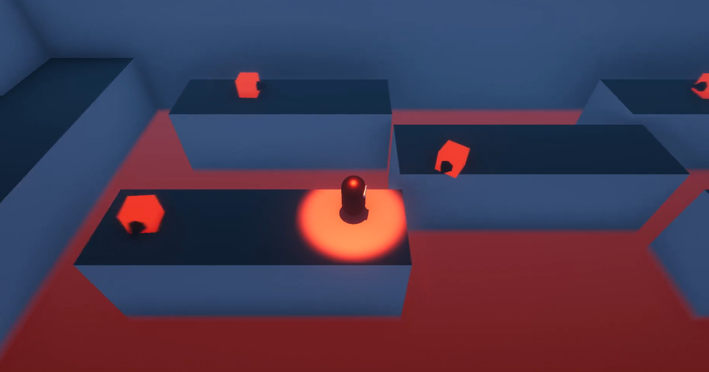

# Stealth-Boy
 In this game you control a ninja character called Stealth Boy and try to avoid enemies. You may choose to engage them but if you get spotted you better run because you won’t be able to do anything once spotted.
 
 # Instructions
 Here you can download all of the project files 
 and code for the game and try it out your self 
 in the Unity editor or by building the game 
 with Unity3D.
 
# Controls
To walk use ADSW keys. 
To attack use Mouse left.
To carry items, use Mouse right.
To Jump press space.

# Video
See teaser video of the gameplay:
https://www.youtube.com/watch?v=bSGo_V0N6OU
